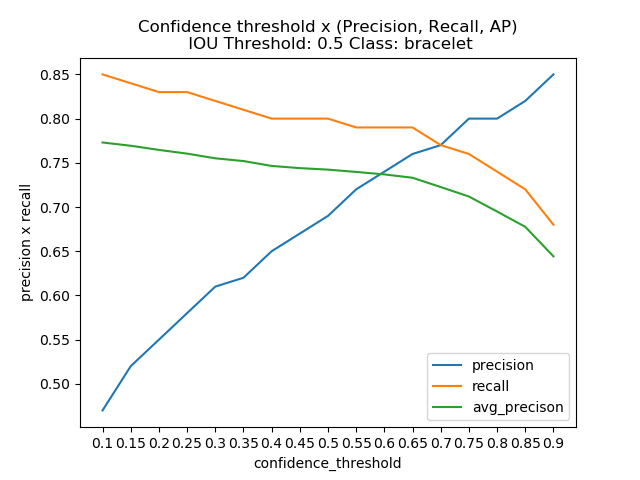

# Object detection evaluation metrics 
#### For Various confidence threshold and IOU threshold

## How to use this project?

This is an additional functionality to the original object detection metrics. By using this you will be able to evaluate your algorithm on different confidence threshold at the same time.

Precision, Recall, Average Precision for various confidence threshold

<!--- Precision, Recall, Average Precision --->



Follow the below steps to get similar graph for evaluation:

1. Create the ground truth files
2. Create your detection files
3. If you want to reproduce the above example run this command: `python conf_threshold.py`
4. (Optional) [You can modify the IOU threshold, Confidence threshold based on your requirement](#optional-arguments)


### Create the ground truth files

- Create a separate ground truth text file for each image in the folder **current_dir/groundtruths/**.
- In these files each line should be in the format: `<class_name> <left> <top> <right> <bottom>`.    
- E.g. The ground truth bounding boxes of the image "2008_000034.jpg" are represented in the file "2008_000034.txt":
  ```
  bottle 6 234 45 362
  person 1 156 103 336
  person 36 111 198 416
  person 91 42 338 500
  ```
    
If you prefer, you can also have your bounding boxes in the format: `<class_name> <left> <top> <width> <height>` (see here [**\***](#asterisk) how to use it). In this case, your "2008_000034.txt" would be represented as:
  ```
  bottle 6 234 39 128
  person 1 156 102 180
  person 36 111 162 305
  person 91 42 247 458
  ```

### Create your detection files

- Create a separate detection text file for each image in the folder **current_dir/detections_1/**.
- The names of the detection files must match their correspond ground truth (e.g. "detections/2008_000182.txt" represents the detections of the ground truth: "groundtruths/2008_000182.txt").
- In these files each line should be in the following format: `<class_name> <confidence> <left> <top> <right> <bottom>` (see here [**\***](#asterisk) how to use it).
- E.g. "2008_000034.txt":
    ```
    bottle 0.14981 80 1 295 500
    bus 0.12601 36 13 404 316  
    horse 0.12526 430 117 500 307  
    pottedplant 0.14585 212 78 292 118  
    tvmonitor 0.070565 388 89 500 196
    ```

Also if you prefer, you could have your bounding boxes in the format: `<class_name> <confidence> <left> <top> <width> <height>`.

### Output

- A txt file named `result_0.5_threshold.txt` (Default IOU threshold=0.5) will be generated with following format: `<class_name> <average_precison> <confidence_threshold> <precision> <recall>`
- E.g. "2008_000034.txt":
    ```
    bottle 0.764 0.1 0.47 0.85
    bus 0.7546 0.1 0.58 0.80  
    horse 0.81 0.1 0.55 0.85 
    pottedplant 0.80 0.1 0.67 0.84  
    tvmonitor 0.93 0.1 0.85 0.94
    bottle 0.76 0.15 0.52 0.84
    bus 0.75 0.15 0.62 0.80
    horse 0.81 0.15 0.61 0.85
    pottedplant 0.80 0.15 0.71 0.83
    tvmonitor 0.92 0.15 0.88 0.94
    bottle 0.76 0.2 0.55 0.83 
    bus 0.75 0.2 0.64 0.80
    horse 0.80 0.2 0.65 0.84
    pottedplant 0.79 0.2 0.73 0.82
    tvmonitor 0.92 0.2 0.89 0.93
    ```
- Precision, Recall, Average Precision x Confidence threshold graph for different classes present in detection in following name format: `classname_thresholdvalue_threshold.png` (E.g. bottle_0.5_threshold.png)

<h3 id=optional-arguments> Optional arguments</h3>

##### IOU threshold:

By default IOU threshold value is: `0.5`
- You can modify this values by providing manual range of threshold values

##### Confidence threshold:

By default Confidence threshold values ranges from: `0.1-1.0 (with a step change of 0.05)'
- You can modify this values according to your requirement

Note: Configuration and arguments are same as `pascalvoc.py`. Refer **Optional arguments** in [Readme](README_base.md) for arguments and configurations. 
All the file paths and optional arguements for this code is present in `settings.py` 

###### Optional:

- This code uses the same Evaluator.py as the `pascal_voc.py` thus it generates the `Precison x Recall` graph
- In order to avoid getting the graph comment those lines from `Evaluator.py` file before running this script

Note: This is an additional functionality added to an existing object detection metics. To check the base functionality refer `README_base.md`
